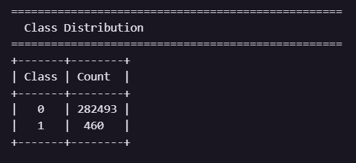
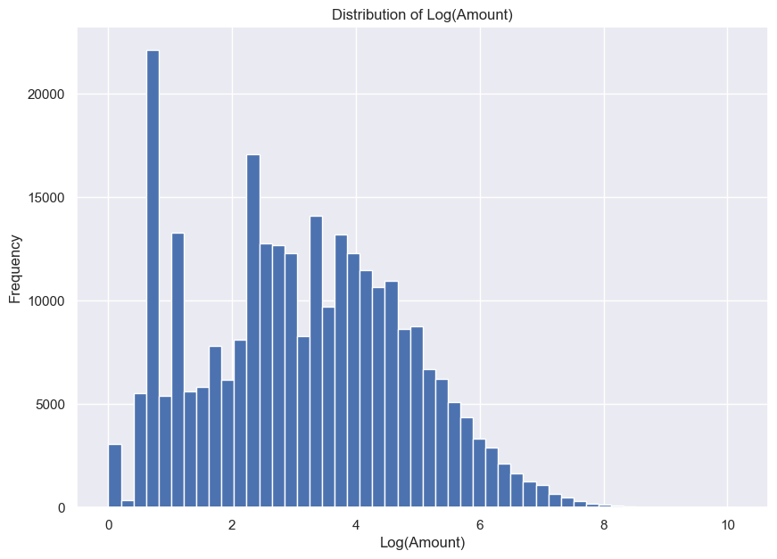
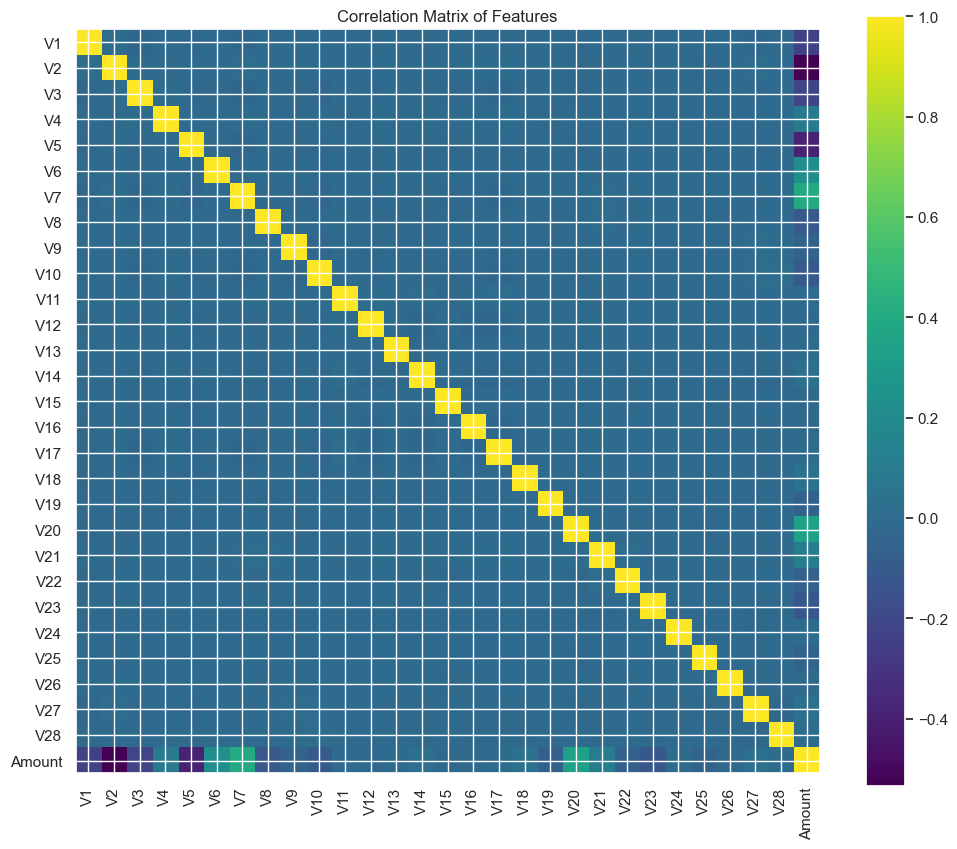
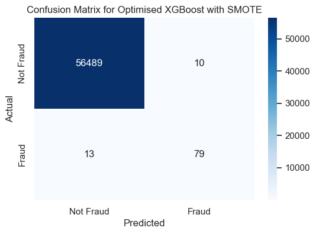
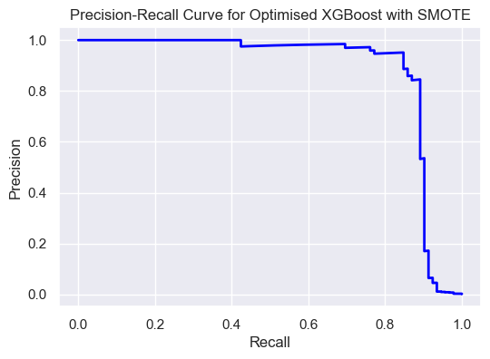
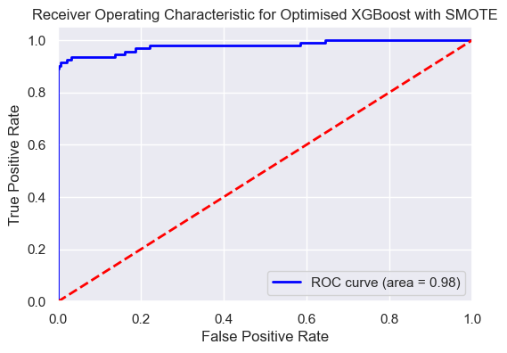
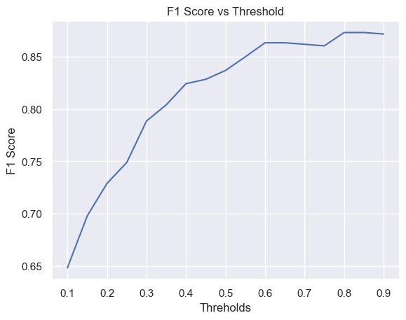
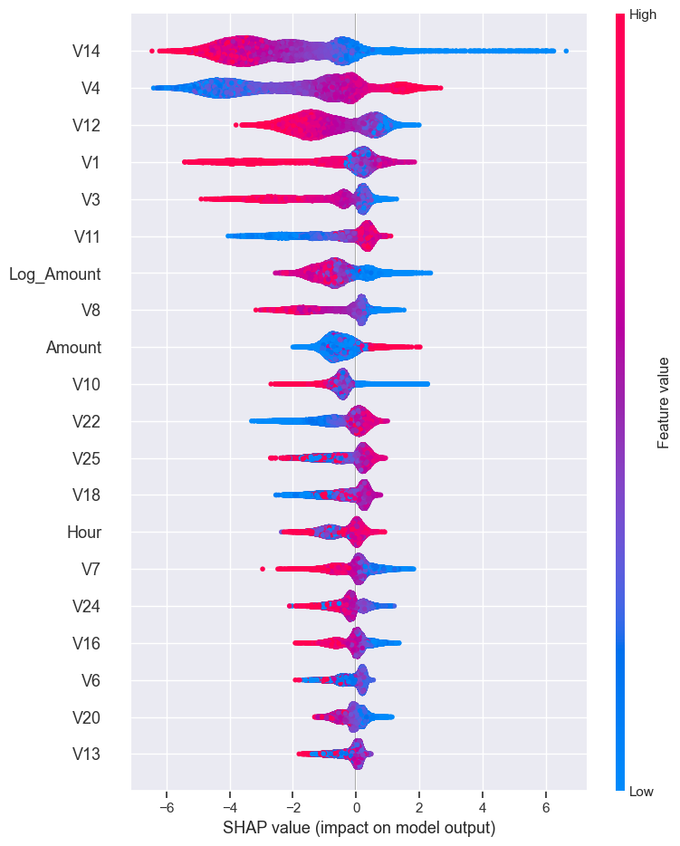

# 💳 Explainable Credit Card Fraud Detection using XGBoost and SHAP

> An end-to-end machine learning pipeline for detecting fraudulent credit card transactions using advanced imbalance handling, model optimization, threshold tuning, and Explainable AI.


---

# 📖 Overview

Credit card fraud is a highly imbalanced classification problem where fraudulent transactions constitute only a tiny fraction of all transactions. Traditional machine learning models often achieve high accuracy while failing to identify fraudulent transactions.

This project develops a complete fraud detection pipeline that focuses on maximizing fraud detection performance while maintaining model interpretability. The workflow includes data preprocessing, feature engineering, model comparison, class imbalance handling, hyperparameter optimization, decision threshold tuning, and Explainable AI using SHAP.

---

# 🎯 Objectives

- Detect fraudulent credit card transactions with high precision and recall.
- Compare multiple machine learning algorithms.
- Handle severe class imbalance using different techniques.
- Optimize model performance through hyperparameter tuning.
- Determine an optimal probability threshold instead of relying on the default 0.5.
- Explain model predictions using SHAP.

---

# 📂 Dataset

**Dataset:** Credit Card Fraud Detection Dataset (Kaggle)

### Characteristics

- **284,807 transactions**
- **492 fraudulent transactions**
- Fraud ratio: **0.172%**
- **30 numerical features**
- PCA-transformed features (`V1-V28`)
- Additional features:
  - `Time`
  - `Amount`

---

# 🚀 Project Workflow

```
Data Understanding
        │
        ▼
Exploratory Data Analysis
        │
        ▼
Feature Engineering
        │
        ▼
Baseline Model Development
        │
        ▼
Class Imbalance Handling
        │
        ▼
Hyperparameter Optimization
        │
        ▼
Decision Threshold Optimization
        │
        ▼
Model Explainability (SHAP)
```

---

# 🔍 Exploratory Data Analysis

Performed comprehensive EDA to understand:

- Class distribution
- Missing values
- Duplicate records
- Transaction amount distribution
- Time distribution
- Correlation analysis
- Fraud vs Non-Fraud comparison

### Sample Visualizations

<p align="center">
  
  
</p>

<p align="center">
  
</p>

# ⚙️ Feature Engineering

Implemented feature engineering to improve model learning.

- Log transformation of transaction amount
- Time-based feature extraction
- Feature scaling
- Feature importance screening

---

# 🤖 Models Evaluated

The following models were trained and compared:

- Logistic Regression
- Random Forest
- Gradient Boosting
- XGBoost

Evaluation metrics:

- Precision
- Recall
- F1 Score
- ROC-AUC
- PR-AUC

---

# ⚖️ Handling Class Imbalance

Compared multiple imbalance handling techniques:

- No balancing
- Class Weights
- SMOTE

Performance comparison was conducted using:

- Precision
- Recall
- F1
- ROC-AUC
- PR-AUC

---

# 🎯 Threshold Optimization

Instead of using the default probability threshold (0.5), multiple thresholds were evaluated to maximize fraud detection performance.

Thresholds evaluated:

```
0.10 → 0.95
```

The optimal operating threshold was selected based on F1-score.

---

# 🔧 Hyperparameter Optimization

Optimized XGBoost using RandomizedSearchCV.

### Tuned Parameters

- n_estimators
- learning_rate
- max_depth
- min_child_weight
- subsample
- colsample_bytree
- gamma
- regularization parameters

Cross-validation was performed using Stratified K-Fold with PR-AUC as the optimization metric.

---

# 📊 Results

## 📊 Model Comparison

| Model | Imbalance Handling | Precision | Recall | F1 | ROC-AUC | PR-AUC |
|:------|:------------------|----------:|-------:|---:|--------:|--------:|
| Logistic Regression | None | 0.870 | 0.652 | 0.745 | 0.983 | 0.754 |
| Random Forest | None | **0.938** | 0.815 | 0.872 | 0.965 | 0.881 |
| Gradient Boosting | None | **0.938** | 0.826 | **0.879** | 0.974 | 0.873 |
| XGBoost | Class Weights | 0.916 | 0.826 | 0.869 | **0.983** | 0.867 |
| XGBoost | SMOTE | 0.796 | **0.891** | 0.841 | 0.978 | **0.889** |
| XGBoost | SMOTE + Hyperparameter & Threshold Optimization | **0.888** | **0.859** | **0.873** | **0.978** | **0.883** |

## Confusion Matrix

<p align="center">
  
</p>

<p align="center">
<i>Confusion Matrix of the final optimized XGBoost model.</i>
</p>

## Precision-Recall Curve

<p align="center">
  
</p>

<p align="center">
<i>Precision-Recall Curve comparing different models.</i>
</p>

## ROC Curve

<p align="center">
  
</p>

## Threshold Optimization

<p align="center">
  
</p>

# 🔍 Explainable AI (SHAP)

Model predictions were interpreted using SHAP.

Generated explanations include:

- Global Feature Importance
- SHAP Summary Plot
- SHAP Bar Plot
- SHAP Dependence Plot
- Waterfall Plot
- Local Prediction Explanation

---

## SHAP Summary Plot

<p align="center">
  
</p>

# 🛠️ Technologies Used

- Python
- Pandas
- NumPy
- Matplotlib
- Seaborn
- Scikit-Learn
- XGBoost
- imbalanced-learn
- SHAP

---

# 📁 Repository Structure

```
Credit-Card-Fraud-Detection/
│
├── data/
│
├── notebooks/
│
├── src/
│
├── models/
│
├── images/
│
├── requirements.txt
│
├── README.md

```

---

# 📈 Key Learnings

- Handling severe class imbalance is critical in fraud detection.
- PR-AUC is a more informative metric than accuracy for highly imbalanced datasets.
- Decision threshold optimization significantly influences deployment performance.
- Hyperparameter tuning improves probability ranking even when F1 gains are modest.
- Explainable AI (SHAP) provides transparency for high-stakes financial predictions.

---

# 🔮 Future Improvements

- LightGBM and CatBoost comparison
- Deep Learning models
- Cost-sensitive learning
- Real-time fraud detection pipeline
- Model deployment using FastAPI
- Docker containerization
- Streamlit dashboard
- MLflow experiment tracking
